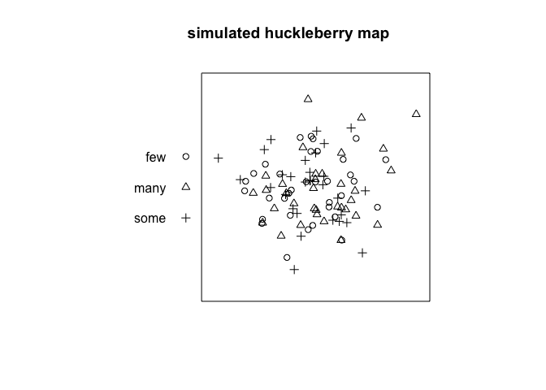
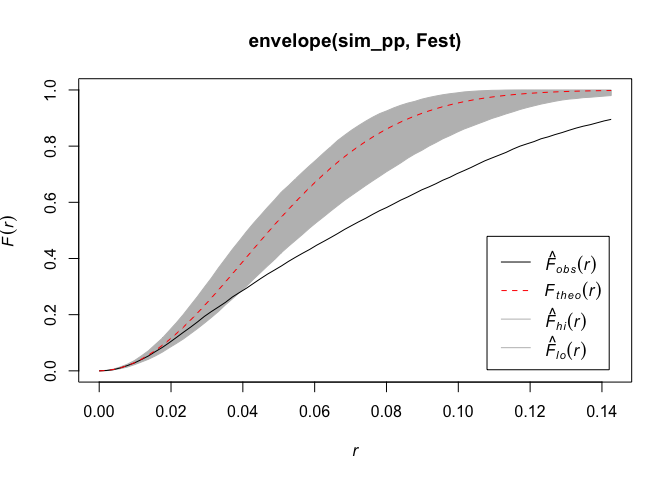
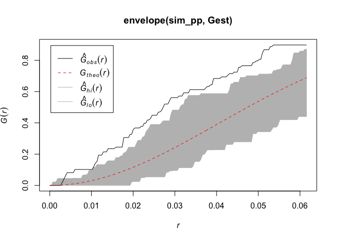
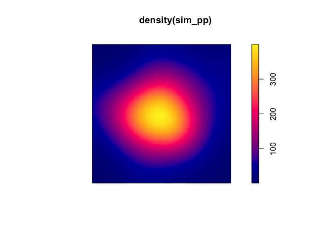

spatstat: Demo
================

This demo will explore point process features in the `spatstat` package.

For additional `spatstat` details run the following code
`vignette('getstart')` in your R console.

#### 1\. Generate Point Process Data

Note this will require both a \(n\) and \(\boldsymbol{s}\)

``` r
lambda <- 100
n <- rpois(1, lambda)

x <- rbeta(n, 5, 5)
y <- rbeta(n, 5, 5)

hucks <- sample(c('few','some','many'), n, replace = T)
sim_pp <- ppp(x, y, window = owin(xrange = c(0,1), yrange = c(0,1)), marks = hucks)
plot(sim_pp, main = 'simulated huckleberry map')
```

<!-- -->

There are also a collection of methods in spatstat to simulation random
point process, see `rpoispp` or many others.

Note `spatstat.data` has a large collection of point process datasets.

#### 2\. Summarize Point Process

``` r
summary(sim_pp)
```

    ## Marked planar point pattern:  98 points
    ## Average intensity 98 points per square unit
    ## 
    ## Coordinates are given to 8 decimal places
    ## 
    ## marks are of type 'character'
    ## Summary:
    ##    Length     Class      Mode 
    ##        98 character character 
    ## 
    ## Window: rectangle = [0, 1] x [0, 1] units
    ## Window area = 1 square unit

#### 3\. Assess Spatial Structure

Remember, the \(F\) function corresponds to empty space and \(G\)
corresponds to nearest neighbor space.

``` r
plot(envelope(sim_pp,Fest))
```

    ## Generating 99 simulations of CSR  ...
    ## 1, 2, 3, 4, 5, 6, 7, 8, 9, 10, 11, 12, 13, 14, 15, 16, 17, 18, 19, 20, 21, 22, 23, 24, 25, 26, 27, 28, 29, 30, 31, 32, 33, 34, 35, 36, 37, 38,
    ## 39, 40, 41, 42, 43, 44, 45, 46, 47, 48, 49, 50, 51, 52, 53, 54, 55, 56, 57, 58, 59, 60, 61, 62, 63, 64, 65, 66, 67, 68, 69, 70, 71, 72, 73, 74, 75, 76,
    ## 77, 78, 79, 80, 81, 82, 83, 84, 85, 86, 87, 88, 89, 90, 91, 92, 93, 94, 95, 96, 97, 98,  99.
    ## 
    ## Done.

<!-- -->

``` r
plot(envelope(sim_pp,Gest))
```

    ## Generating 99 simulations of CSR  ...
    ## 1, 2, 3, 4, 5, 6, 7, 8, 9, 10, 11, 12, 13, 14, 15, 16, 17, 18, 19, 20, 21, 22, 23, 24, 25, 26, 27, 28, 29, 30, 31, 32, 33, 34, 35, 36, 37, 38,
    ## 39, 40, 41, 42, 43, 44, 45, 46, 47, 48, 49, 50, 51, 52, 53, 54, 55, 56, 57, 58, 59, 60, 61, 62, 63, 64, 65, 66, 67, 68, 69, 70, 71, 72, 73, 74, 75, 76,
    ## 77, 78, 79, 80, 81, 82, 83, 84, 85, 86, 87, 88, 89, 90, 91, 92, 93, 94, 95, 96, 97, 98,  99.
    ## 
    ## Done.

<!-- -->

The envelope procedure compares the observed results with a set of
simulated homogeneous point processes.

#### 4\. Modeling Intensity

``` r
plot(density(sim_pp))
```

<!-- -->

``` r
ppm(unmark(sim_pp) , ~1, Poisson())
```

    ## Stationary Poisson process
    ## Intensity: 98
    ##             Estimate      S.E.  CI95.lo  CI95.hi Ztest     Zval
    ## log(lambda) 4.584967 0.1010153 4.386981 4.782954   *** 45.38886

``` r
ppm(unmark(sim_pp) , ~x  + y, Poisson())
```

    ## Nonstationary Poisson process
    ## 
    ## Log intensity:  ~x + y
    ## 
    ## Fitted trend coefficients:
    ## (Intercept)           x           y 
    ##  4.67296514 -0.14141011 -0.03634356 
    ## 
    ##                Estimate      S.E.    CI95.lo   CI95.hi Ztest       Zval
    ## (Intercept)  4.67296514 0.2640037  4.1555275 5.1904028   *** 17.7003797
    ## x           -0.14141011 0.3501801 -0.8277505 0.5449302       -0.4038211
    ## y           -0.03634356 0.3500196 -0.7223694 0.6496823       -0.1038329
